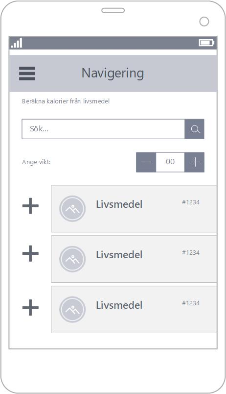
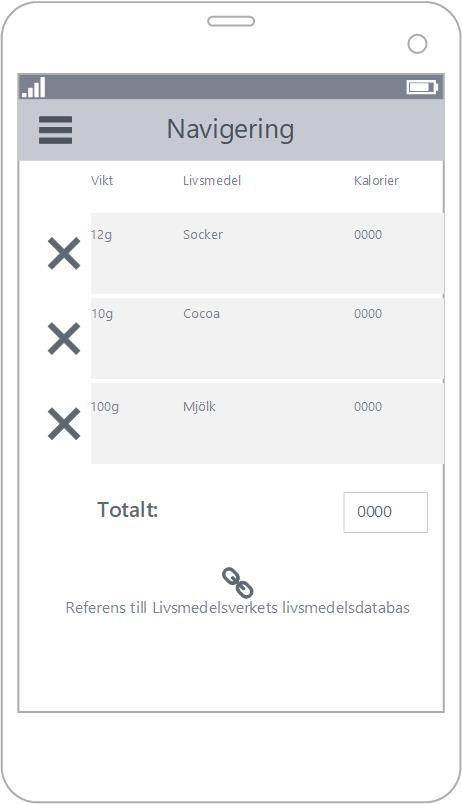
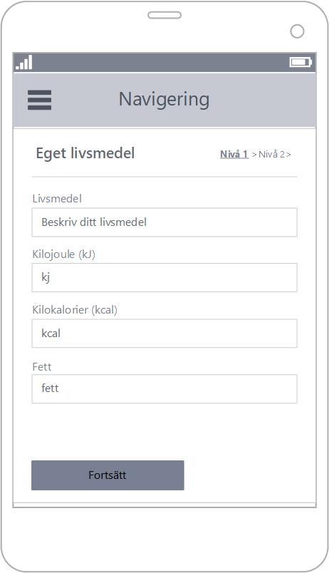
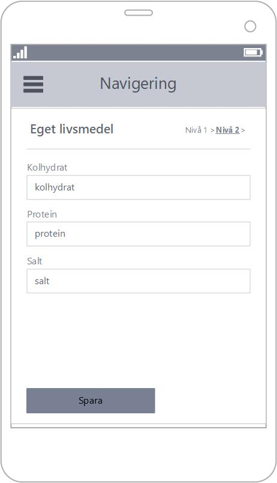

# KaloriNix
Målet är en webb-baserad livsmedelsdatabas som användare kan räkna ut kalorier ifrån. Överst på webbplatsen finns möjlighet att navigera. På webbplatsens första sidan hittar användaren ett sökformulär. Användaren anger livsmedel och vikt. Systemet beräknar då kalori innehåll på livsmedlet och sparar resultatet i en dagbok. Med ett formulär har användaren möjlighet att själv skriva in egna livsmedel. 

# Krav
1. Implementera livsmedelsverkets livsmedelsdatabas
2. Navigera på webbplatsen
3. Ett sökformulär
4. En dagbok
5. Ett formulär att skriva in eget livsmedel

# Databas
<b>Livsmedel</b> 
livsmedel: 'string' 
kj: 'number' 
kcal: 'number' 
fett: 'number' 
kolhydrat: 'number' 
protein: 'number' 
salt: 'number' 

# User interface

